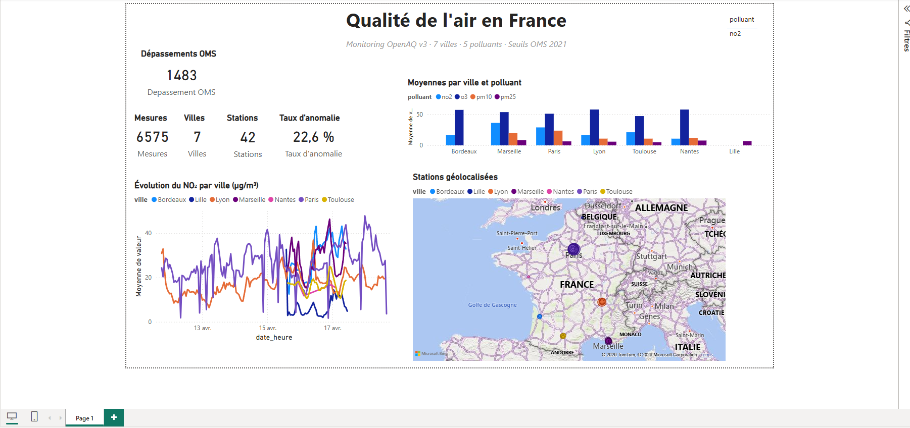

# 🌫️ Dashboard Qualité de l'Air — France

Pipeline **ETL Python → SQLite → Streamlit** pour collecter, analyser et visualiser la qualité de l'air dans 7 villes françaises, avec détection automatique des dépassements des seuils OMS.

---

## Aperçu

- **7 villes** suivies : Paris, Lyon, Marseille, Bordeaux, Lille, Nantes, Toulouse
- **5 polluants** : PM2.5, PM10, NO₂, O₃, CO
- **Seuils OMS 2021** utilisés comme référence pour la détection d'anomalies
- **Deux sorties** : dashboard Streamlit interactif + export CSV pour Power BI

## Architecture

```
API OpenAQ v3  ──►  Pipeline ETL  ──►  SQLite  ──┬──►  Streamlit (dashboard web)
  (REST)           (Python/pandas)    (3 tables) │
                                                 └──►  CSV  ──►  Power BI
```

### Modèle de données

```
stations (id, nom, ville, lat, lon)
    │
    └── sensors (sensor_id, location_id, polluant, unité)
              │
              └── mesures (sensor_id, date_heure, valeur, anomalie)
```

---

## Fonctionnalités

| Couche | Description |
|---|---|
| **Extract** | Appels à l'API OpenAQ v3 (bounding box par ville, authentification par clé API, gestion du rate limit) |
| **Transform** | Nettoyage (doublons, valeurs négatives, aberrations > 10× seuil OMS), typage, flag d'anomalie |
| **Load** | Écriture idempotente en SQLite (contrainte UNIQUE sur `sensor_id + date_heure`) |
| **Analyse** | KPIs par ville/polluant, tendances journalières, top anomalies, pics de pollution |
| **Dashboard** | Streamlit interactif : filtres ville/polluant/période, carte géographique, seuils OMS affichés |
| **Export BI** | 3 CSV (faits + dimensions + KPIs) prêts pour Power BI |

---

## Installation

```bash
# 1. Cloner le repo
git clone https://github.com/fotso001/qualite-air-france.git
cd qualite-air-france

# 2. Créer un environnement virtuel
python -m venv .venv
source .venv/bin/activate   # Windows : .venv\Scripts\activate

# 3. Installer les dépendances
pip install -r requirements.txt

# 4. Créer une clé API OpenAQ (gratuite)
#    https://explore.openaq.org/register
#    Puis copier .env.example en .env et y coller la clé
cp .env.example .env
```

## Utilisation

```bash
# Lancer le pipeline ETL (collecte les 7 derniers jours)
python etl/collect_data.py

# Générer les KPIs + exporter les CSV pour Power BI
python etl/analyse.py

# Lancer le dashboard Streamlit
streamlit run dashboard/app.py
```

---

## Import dans Power BI

Les CSV générés dans `data/powerbi/` s'importent directement dans Power BI Desktop :

1. **Obtenir les données** → Texte/CSV → sélectionner `mesures.csv`, `stations.csv`, `kpis_ville.csv`
2. Créer les relations : `mesures[station_id]` ↔ `stations[station_id]`
3. Visualisations possibles :
   - Cartes KPIs (total mesures, anomalies, villes)
   - Courbe temporelle par polluant avec ligne de seuil OMS
   - Barres empilées par ville × polluant
   - Carte géographique des stations

---

## Stack technique

- **Python 3.10+** — `pandas`, `requests`, `python-dotenv`
- **SQLite** — base locale, pas de serveur à gérer
- **Streamlit + Plotly** — dashboard interactif
- **OpenAQ v3 API** — données ouvertes, clé gratuite

## Structure du projet

```
qualite-air-france/
├── etl/
│   ├── collect_data.py      # Pipeline ETL (API → SQLite)
│   └── analyse.py           # KPIs + export Power BI
├── dashboard/
│   └── app.py               # Dashboard Streamlit
├── data/
│   ├── air_quality.db       # BDD SQLite (générée)
│   └── powerbi/             # CSV pour Power BI (générés)
├── .env.example             # Template de configuration
├── .gitignore
├── requirements.txt
└── README.md
```
> 🌐 **Démo en ligne :** https://qualite-air-france-venqzlewb9ejx5qf879tek.streamlit.app/
---

## Aperçu du rapport Power BI



Le rapport complet est disponible au format PDF : [dashboard-qualite-air.pdf](dashboard-powerbi/dashboard-qualite-air.pdf)

Le rapport couvre :
- Indicateurs clés : mesures collectées, villes, stations, dépassements OMS, taux d'anomalie
- Évolution temporelle du NO₂ par ville avec seuil OMS de référence
- Comparatif des moyennes par ville et par polluant
- Géolocalisation des stations, taille des bulles proportionnelle aux anomalies détectées

Mesures DAX utilisées : `Nb Mesures`, `Nb Villes`, `Nb Stations`, `Depassements OMS`, `Taux anomalie`.

---


## Sources

- [OpenAQ API v3 documentation](https://docs.openaq.org/)
- [WHO global air quality guidelines 2021](https://www.who.int/publications/i/item/9789240034228)